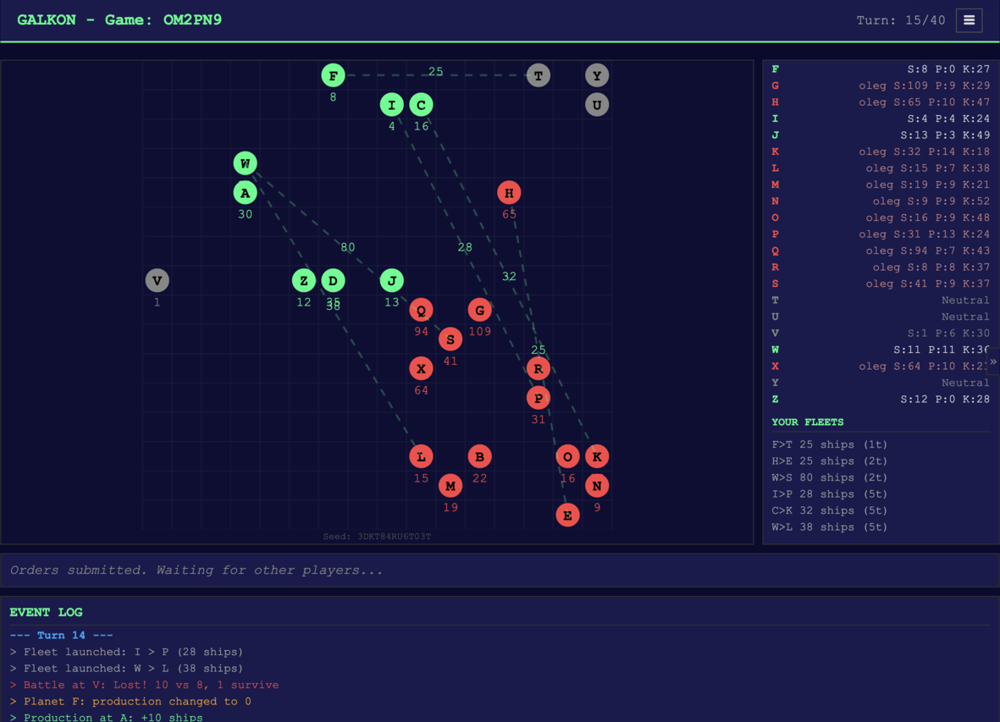
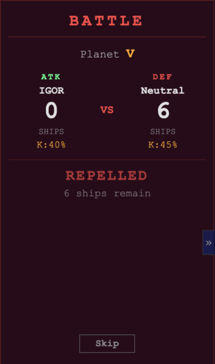
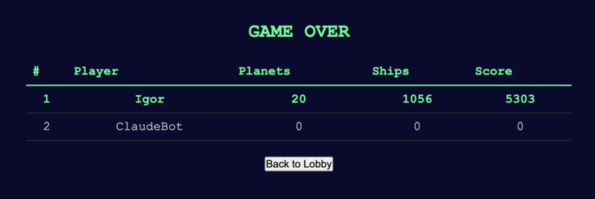

# Galkon

Galcon is a multi-player, turn-based space conquest game. Players command fleets of ships, capture neutral and enemy planets, build up production, and try to dominate the galaxy.

Based on GALCN220 by Analog Dial, itself based on GALCON24.EXE by Rick Raddatz (1988).

## How to play

1. One player creates a game and shares the game code. Other players join using the code.
2. The host starts the game. Players vote on the galaxy layout.
3. Each planet has a **production** rate (ships generated per turn) and a **kill ratio** (combat effectiveness of defending ships). These values vary across planets, making some strategically more valuable than others.
4. Each turn, send fleets from your planets to capture others. Click planets on the map to fill in the From/To fields. Your opponent cannot see your orders.
5. After both players submit, the turn resolves: fleets move, battles happen, planets produce ships.
6. The player with the higher score after all turns wins.

Full game rules: [galcon-rules.md](galcon-rules.md)

## Screenshots

Long time ago, in a galaxy far, far away:



One battle after another:



I'll be back... said Claude:



## Make them fight!

How to run two bots against each other and spectate the game.

Open three terminals.

Terminal 1, run the server:

```bash
just build run
```

Terminal 2, start the bot:

```bash
just bot-start
```
Bot will create a game and print out the game code. Copy that code.

Terminal 3, join the game with another bot:

```bash
just bot-join <game-code>
```

Now, both bots will play against each other. Watch the game joining as _spectator_ at http://localhost:8080/